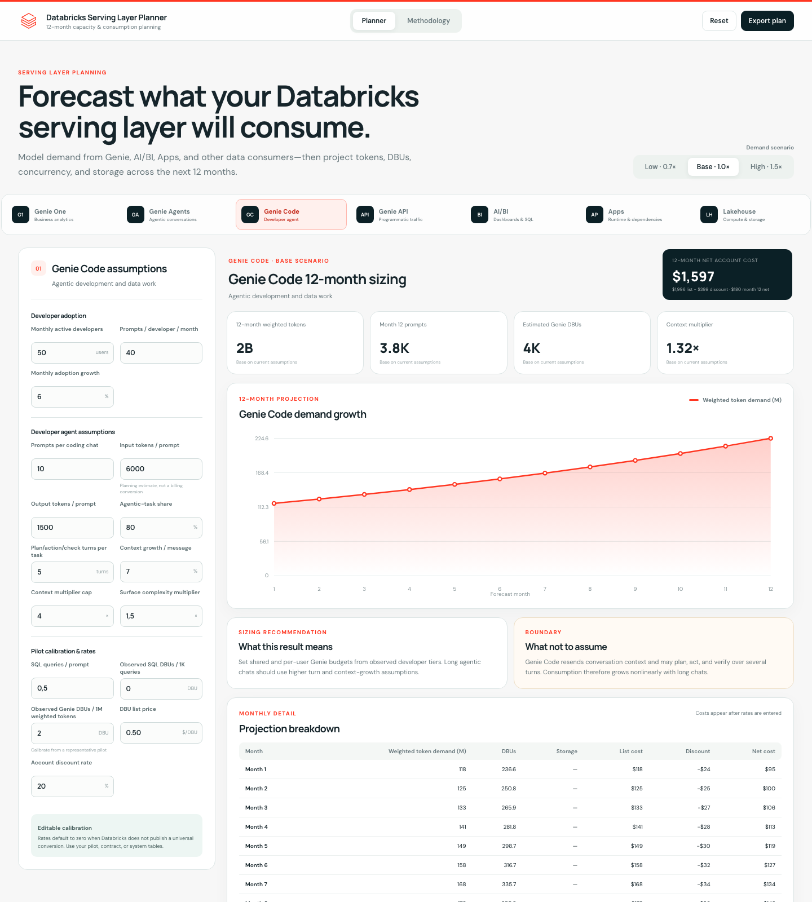
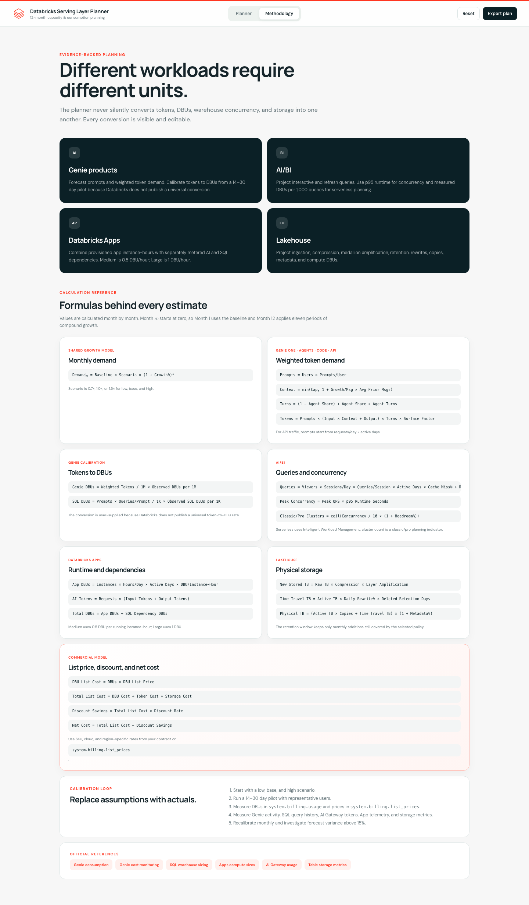
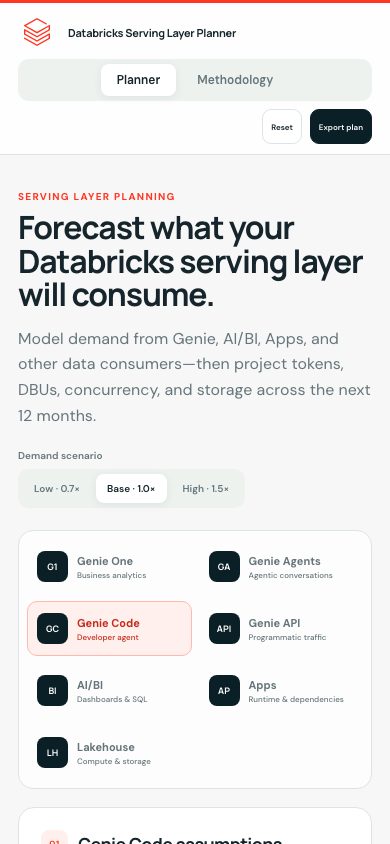

# Databricks Serving Layer Planner

A browser-based, 12-month scenario planner for the consumption side of the Databricks
lakehouse: Genie, AI/BI, Apps, serving compute, and the storage those experiences consume.

> **Planning tool, not a quote.** This project is not an official Databricks pricing
> calculator. Validate every forecast against your cloud, region, SKU, contract,
> workload telemetry, and `system.billing` data.



## Why this exists

Databricks teams have mature ways to size clusters, SQL warehouses, and storage, but
AI workloads introduce less familiar drivers:

- prompts, context growth, output tokens, and internal agent turns;
- different usage patterns across Genie One, Agents, Code, and APIs;
- LLM demand that must be calibrated to billed DBUs;
- SQL, model, App, and storage dependencies billed separately;
- adoption and data growth that compound over time;
- list pricing that differs from negotiated account pricing.

This estimator keeps tokens, DBUs, query concurrency, and storage as separate units.
It only converts them when the user supplies an explicit calibration or price.

## Supported workloads

| Workload | Primary forecast | Additional sizing outputs |
|---|---|---|
| Genie One | Weighted token demand | Prompts, context growth, SQL DBUs, calibrated Genie DBUs |
| Genie Agents | Weighted token demand | Agent-mode mix, internal turns, SQL dependencies |
| Genie Code | Weighted token demand | Developer adoption, agentic turns, nonlinear chat context |
| Genie API | Weighted token demand | Request growth, peak requests/minute, underlying Agent DBUs |
| AI/BI | SQL queries | Peak concurrency, classic/pro cluster indicator, DBUs, storage |
| Databricks Apps | AI tokens | App instance-hours, app DBUs, SQL DBUs, CPU/memory envelope |
| Lakehouse | Physical storage | Ingestion, retention, time travel, compute DBUs |

## Features

- Seven workload-specific sizing models
- Low, base, and high demand scenarios
- Twelve monthly projections with compound growth
- Editable assumptions in a dynamic sidebar
- Weighted token-demand modeling for Genie products
- Pilot-calibrated token-to-DBU conversion
- AI/BI concurrency and cluster planning
- Databricks Apps Medium/Large runtime modeling
- Lakehouse ingestion, medallion amplification, retention, and time-travel storage
- DBU list price and account discount inputs
- List cost, discount savings, and net account cost
- Monthly projection table and interactive SVG chart
- JSON export containing assumptions, formulas, projections, and caveats
- Responsive desktop and mobile layouts
- No backend, build step, tracking, or external runtime dependency

## Screenshots

### Twelve-month planner


### Transparent calculation methodology



### Mobile experience



## Run locally

Requirements:

- Any modern browser
- Python 3 for the optional local static server
- Node.js only when running the model tests

```bash
git clone https://github.com/berrybluecode/databricks-serving-layer-planner.git
cd databricks-serving-layer-planner
python3 -m http.server 8770
```

Open [http://localhost:8770](http://localhost:8770).

## Tests

```bash
node model.test.js
node portfolio-model.test.js
```

- `model.test.js` preserves the calculations from the original Genie API QPM
  spreadsheet.
- `portfolio-model.test.js` validates every portfolio workload, 12-month projection,
  scenarios, calibration, DBUs, storage growth, list cost, discount, and net cost.

## Core formulas

The complete formula reference is also available in the application's
**Methodology** tab.

### Monthly growth

```text
Demand[m] = Baseline × Scenario multiplier × (1 + Monthly growth rate)^m
```

`m` starts at zero. Month 1 is the baseline; Month 12 applies eleven growth periods.

Scenario multipliers:

- Low: `0.7×`
- Base: `1.0×`
- High: `1.5×`

### Genie prompt and token demand

```text
Prompts = Active users × Prompts per user per month

Context factor =
  min(
    Context cap,
    1 + Context growth per message × Average prior messages
  )

Mode turns =
  (1 − Agent-mode share)
  + Agent-mode share × Internal turns per agent task

Weighted tokens =
  Prompts
  × (Input tokens × Context factor + Output tokens)
  × Mode turns
  × Surface complexity multiplier
```

For Genie API, baseline prompts are:

```text
Prompts = Requests per day × Active days per month
```

### Genie DBU calibration

Databricks does not publish a universal token-to-DBU conversion for Genie. Derive it
from a representative 14–30 day pilot:

```text
Observed DBUs per 1M weighted tokens =
  Pilot Genie DBUs / (Pilot weighted tokens / 1,000,000)

Forecast Genie DBUs =
  Forecast weighted tokens / 1,000,000
  × Observed DBUs per 1M weighted tokens
```

SQL compute remains separate:

```text
SQL DBUs =
  Prompts × SQL queries per prompt / 1,000
  × Observed SQL DBUs per 1,000 queries
```

### AI/BI demand

```text
Interactive queries =
  Viewers × Sessions per viewer per day × Queries per session
  × Active days × Cache-miss share

Total queries = Interactive queries + Scheduled refresh queries

Peak concurrency = Peak queries/second × p95 query runtime

Classic/Pro clusters =
  ceil(Peak concurrency / 10 × (1 + Headroom rate))
```

The ten-query rule is a classic/pro planning heuristic from Databricks guidance.
Serverless SQL warehouses use Intelligent Workload Management and should be
calibrated with observed DBUs per 1,000 queries.

### Databricks Apps

```text
App DBUs =
  Running instances × Runtime hours/day × Active days/month
  × DBUs per running instance-hour

AI tokens = AI requests × (Input tokens + Output tokens)

Total DBUs = App DBUs + SQL dependency DBUs
```

Official App compute rates modeled by the estimator:

- Medium: `0.5 DBU` per running instance-hour
- Large: `1.0 DBU` per running instance-hour

Model serving, SQL warehouses, jobs, databases, and storage are entered as separate
dependencies.

### Lakehouse storage

```text
New stored TB =
  Raw TB × Compression factor × Medallion-layer amplification

Time-travel TB =
  Active TB × Daily rewrite rate × Deleted-file retention days

Physical TB =
  (Active TB × Copy multiplier + Time-travel TB)
  × (1 + Metadata overhead)
```

The retention window includes only monthly additions still inside the selected policy.

### List price, discount, and net cost

```text
DBU list cost = DBUs × DBU list price

Total list cost =
  DBU list cost + Token list cost + Storage list cost

Discount savings = Total list cost × Account discount rate

Net account cost = Total list cost − Discount savings
```

Prices default to zero. Enter SKU-, cloud-, and region-specific rates from your
contract or `system.billing.list_prices`.

## Recommended calibration data

Replace assumptions with observed values monthly:

- Billing and DBUs: `system.billing.usage`
- Time-effective list prices: `system.billing.list_prices`
- Genie Code interactions: `system.access.assistant_events`
- Genie One and Agents activity: audit logs and product monitoring
- SQL execution, queueing, read, and spill metrics: `system.query.history`
- Warehouse configuration and scaling: `system.compute.warehouses` and
  `system.compute.warehouse_events`
- AI tokens and latency: `system.ai_gateway.usage`
- App requests, errors, latency, and resource symptoms: App OpenTelemetry tables
- Storage, time-travel, and vacuumable bytes:
  `ANALYZE TABLE ... COMPUTE STORAGE METRICS`

Investigate forecast variance above 15%, persistent SQL queueing, growing ingestion
backlogs, sustained resource pressure, or projected budget overruns.

## Project structure

```text
.
├── index.html                 # Planner and methodology UI
├── styles.css                # Responsive Databricks-inspired design system
├── app.js                    # Dynamic controls, charts, table, export
├── portfolio-model.js        # Seven-workload 12-month forecast engine
├── portfolio-model.test.js   # Portfolio model tests
├── model.js                  # Original QPM simulation engine
├── model.test.js             # Original spreadsheet regression tests
├── assets/
│   └── databricks.svg
├── docs/images/              # README screenshots
└── source-artifacts/         # Original spreadsheet exports and references
```

## Important modeling boundaries

- Weighted token demand is a planning heuristic, not a Databricks billable-token
  statement.
- Genie is billed through underlying LLM consumption in DBUs. A pilot calibration is
  required before the estimator produces Genie DBUs.
- Genie API is a channel into Genie Agents, not an independent billing surface.
- Service-principal Genie usage can have different allowance treatment from identified
  human users.
- Serverless SQL does not use a fixed ten-query-per-cluster capacity rule.
- App compute is provisioned while running; its dependencies are metered separately.
- Storage rewrite and time-travel formulas should be replaced with measured values when
  available.
- Contract discounts can differ by SKU. The single discount input is a blended planning
  assumption.

## Official references

- [Genie consumption guide](https://docs.databricks.com/aws/en/genie/consumption-guide)
- [Monitor Genie cost](https://docs.databricks.com/aws/en/genie/monitor-cost)
- [Genie budgets and controls](https://docs.databricks.com/aws/en/genie/budgets)
- [SQL warehouse sizing and queueing](https://docs.databricks.com/aws/en/compute/sql-warehouse/warehouse-behavior)
- [BI workload settings](https://docs.databricks.com/aws/en/compute/sql-warehouse/bi-workload-settings)
- [Databricks Apps compute sizes](https://docs.databricks.com/aws/en/dev-tools/databricks-apps/compute-size)
- [AI Gateway usage tracking](https://docs.databricks.com/aws/en/ai-gateway/usage-tracking)
- [Billing system table](https://docs.databricks.com/aws/en/admin/system-tables/billing)
- [Pricing system table](https://docs.databricks.com/aws/en/admin/system-tables/pricing)
- [Table storage metrics](https://docs.databricks.com/aws/en/tables/size)

## Disclaimer

Databricks and the Databricks logo are trademarks of Databricks, Inc. This repository
is an independent planning utility and is not an official Databricks product or price
quote.
