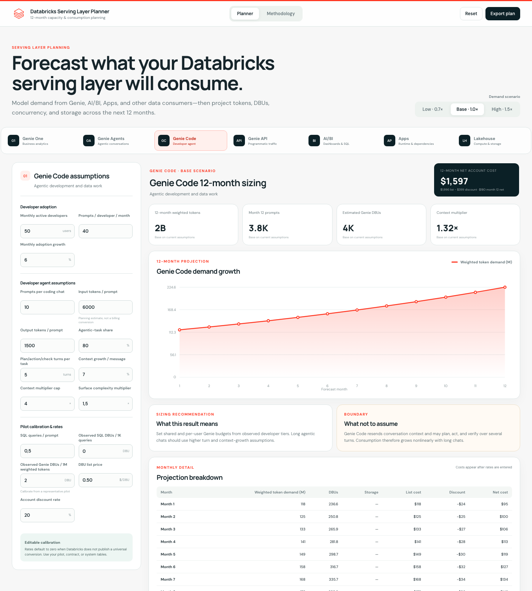
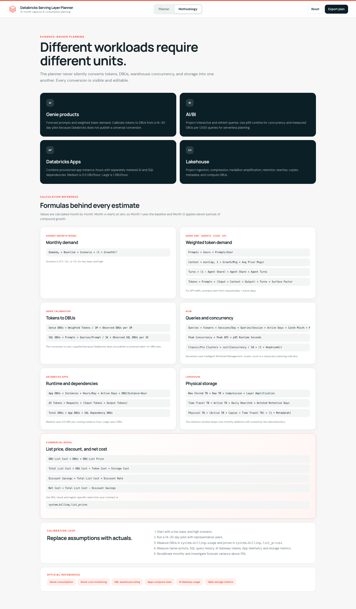
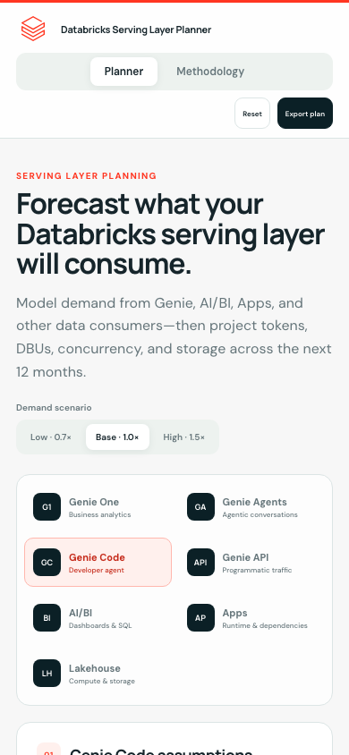

# Databricks Serving Layer Planner

A browser-based, 12-month scenario planner for the consumption side of the Databricks
lakehouse: Genie, AI/BI, Apps, serving compute, and the storage those experiences consume.

> **Planning tool, not a quote.** This project is not an official Databricks pricing
> calculator. Validate every forecast against your cloud, region, SKU, contract,
> workload telemetry, and `system.billing` data.



## Why this exists

Databricks teams have mature ways to size clusters, SQL warehouses, and storage, but
AI workloads introduce less familiar drivers:

- prompts, context growth, output tokens, and internal agent turns;
- different usage patterns across Genie One, Agents, Code, and APIs;
- LLM demand that must be calibrated to billed DBUs;
- SQL, model, App, and storage dependencies billed separately;
- adoption and data growth that compound over time;
- list pricing that differs from negotiated account pricing.

This estimator keeps tokens, DBUs, query concurrency, and storage as separate units.
It only converts them when the user supplies an explicit calibration or price.

## Supported workloads

| Workload | Primary forecast | Additional sizing outputs |
|---|---|---|
| Genie One | Weighted token demand | Prompts, context growth, SQL DBUs, calibrated Genie DBUs |
| Genie Agents | Weighted token demand | Agent-mode mix, internal turns, SQL dependencies |
| Genie Code | Weighted token demand | Developer adoption, agentic turns, nonlinear chat context |
| Genie API | Weighted token demand | Request growth, peak requests/minute, underlying Agent DBUs |
| AI/BI | SQL queries | Peak concurrency, classic/pro cluster indicator, DBUs, storage |
| Databricks Apps | AI tokens | App instance-hours, app DBUs, SQL DBUs, CPU/memory envelope |
| Lakehouse | Physical storage | Ingestion, retention, time travel, compute DBUs |

## Features

- Seven workload-specific sizing models
- Light, regular, and power user mixes for Genie (p90 users 8–15× the median)
- Separate SQL and Genie (serverless real-time inference) list prices
- 150 DBU/user/month Genie free allowance and One/Agents promo horizon
- Twelve monthly projections with compound growth
- Editable assumptions in a dynamic sidebar
- Weighted token-demand modeling for Genie products
- Pilot-calibrated Genie DBUs per active user per month by surface
- AI/BI concurrency and cluster planning
- Databricks Apps Medium/Large runtime modeling
- App and AI/BI query-complexity presets with recognizable workload examples
- Data-scanned volume adjustment for SQL estimates
- Optional Lakebase and embedded-AI dependencies for Apps
- Azure North Europe SQL `$0.91/DBU` and Genie SRTI `$0.084/DBU`, overwritten from `system.billing.list_prices` in the App
- Lakehouse ingestion, medallion amplification, retention, and time-travel storage
- DBU list price and account discount inputs
- List cost, discount savings, and net account cost
- Monthly projection table and interactive SVG chart
- JSON export containing assumptions, formulas, projections, and caveats
- Responsive desktop and mobile layouts
- Workspace calibration from system tables with task-time attribution, credibility
  blending, and a P10–P90 cost band (Databricks App only)
- CFO value layer: hard savings, cost avoidance, recaptured productivity, revenue
  margin, and risk-adjusted value, with Gartner/Forrester realization rules so
  hours × wage is never booked as cash ROI
- Static build needs no backend, build step, tracking, or external runtime dependency

## Screenshots

### Twelve-month planner


### Transparent calculation methodology



### Mobile experience



## Run locally

Requirements:

- Any modern browser
- Python 3 for the optional local static server
- Node.js only when running the model tests

```bash
git clone https://github.com/berrybluecode/databricks-serving-layer-planner.git
cd databricks-serving-layer-planner
python3 -m http.server 8770
```

Open [http://localhost:8770](http://localhost:8770).

## Databricks App

The planner is deployed to the `dqx-app-demo` workspace:

**[Open the Databricks Serving Layer Planner](https://serving-layer-planner-7474659469216989.aws.databricksapps.com)**

Workspace authentication is required. The deployment is a FastAPI wrapper that also
serves the read-only calibration API over `system.billing` and `system.query`
through one SQL warehouse. It uses no model endpoint, Lakebase database, or secrets.

```bash
# Deploy the current directory after uploading it to a workspace source path
databricks apps deploy serving-layer-planner \
  --source-code-path /Workspace/Users/<user>/apps/serving-layer-planner \
  --profile dqx-app-demo
```

Health endpoint:

```text
GET /api/health
```

## Tests

```bash
node model.test.js
node portfolio-model.test.js
```

- `model.test.js` preserves the calculations from the original Genie API QPM
  spreadsheet.
- `portfolio-model.test.js` validates every portfolio workload, 12-month projection,
  scenarios, calibration, DBUs, storage growth, list cost, discount, and net cost.

## Core formulas

The complete formula reference is also available in the application's
**Methodology** tab.

### Monthly growth

```text
Demand[m] = Baseline × Scenario multiplier × (1 + Monthly growth rate)^m
```

`m` starts at zero. Month 1 is the baseline; Month 12 applies eleven growth periods.

Scenario multipliers:

- Light mix (Genie): 80% light / 18% regular / 2% power users, with tier multipliers 0.3× / 1× / 12×
- Regular mix: 55% / 35% / 10%
- Power mix: 20% / 40% / 40%
- AI/BI and Apps still use 0.7× / 1.0× / 1.5× demand

### Genie DBU calibration

Genie billing rows have no token counts. Calibrate from `system.billing.usage` using `usage_metadata.genie.surface` and `identity_metadata.run_as`:

```text
Observed DBU / user / month =
  Σ Genie DBUs (free + billed) / distinct run_as / months

Gross Genie DBUs =
  Users × Mix intensity × DBU/user/month × Language factor

Language factor = 1 + Non-English share × (2.9 − 1)

Billed Genie DBUs =
  0 for human Genie One / Agents during promo
  max(0, Gross − Users × 150) otherwise
  (API / service principals have no allowance)

Genie list cost = Billed Genie DBUs × SRTI list price
SQL list cost   = SQL DBUs × SQL list price
```

Do not apply the SQL warehouse list price to Genie DBUs. `GENIE_FREE_USAGE` has no list price.

SQL compute remains separate:

```text
SQL DBUs =
  Prompts × SQL queries per prompt / 1,000
  × Observed SQL DBUs per 1,000 queries
```

### AI/BI demand

```text
Interactive queries =
  Viewers × Sessions per viewer per day × Queries per session
  × Active days

Total queries = Interactive queries + Scheduled refresh queries

Volume factor =
  max(0.25, √(Average GB scanned per query / Profile reference GB))

SQL DBUs =
  Total queries / 1,000 × Complexity-profile DBUs per 1,000 queries
  × Volume factor

Peak concurrency = Peak queries/second × p95 query runtime
```

Serverless SQL warehouses use Intelligent Workload Management. Complexity profiles are
starting assumptions and should be calibrated with observed DBUs, runtime, bytes read,
and query count.

### Databricks Apps

```text
App DBUs =
  Running instances × Runtime hours/day × Active days/month
  × DBUs per running instance-hour

App requests =
  Active users × Requests per user per day × Active days

SQL queries =
  App requests × SQL queries per request

Volume factor =
  max(0.25, √(Average GB scanned per query / Profile reference GB))

SQL DBUs =
  SQL queries / 1,000 × Complexity-profile DBUs per 1,000 queries
  × Volume factor

AI tokens = AI requests × (Input tokens + Output tokens)

Total DBUs = App DBUs + SQL DBUs + Optional Lakebase DBUs
```

Official App compute rates modeled by the estimator:

- Medium: `0.5 DBU` per running instance-hour
- Large: `1.0 DBU` per running instance-hour

Model serving, SQL warehouses, jobs, databases, and storage are entered as separate
dependencies.

The planner ships with four explainable SQL profiles:

- **Light** — KPI tiles and filtered Gold aggregates (`8 DBU / 1K queries`)
- **Medium** — multi-join dashboards (`40 DBU / 1K queries`)
- **Heavy** — wide scans, windows, and write-back validation (`180 DBU / 1K queries`)
- **Extreme** — uncached scans or an app sharing a warehouse with ETL (`702 DBU / 1K queries`)

These are planning defaults, not Databricks price guarantees. The Extreme profile is
calibrated from the DQX demo workspace; replace every profile with observed
`system.query.history` and `system.billing.usage` data for the target account.

### Regional pricing

This deployment is configured for **Azure North Europe SQL at `$0.91/DBU`** and
**Genie serverless real-time inference at `$0.084/DBU`**. The App overwrites both
from `system.billing.list_prices`. The account discount starts at **0%**.

### Lakehouse storage

```text
New stored TB =
  Raw TB × Compression factor × Medallion-layer amplification

Time-travel TB =
  Active TB × Daily rewrite rate × Deleted-file retention days

Physical TB =
  (Active TB × Copy multiplier + Time-travel TB)
  × (1 + Metadata overhead)
```

The retention window includes only monthly additions still inside the selected policy.

### List price, discount, and net cost

```text
SQL DBU list cost = SQL DBUs × SQL list price
Genie DBU list cost = Billed Genie DBUs × SRTI list price

Total list cost =
  SQL DBU cost + Genie DBU cost + Token list cost + Storage list cost

Discount savings = Total list cost × Account discount rate

Net account cost = Total list cost − Discount savings
```

Read SKU prices from `system.billing.list_prices`. Do not price Genie DBUs with the SQL warehouse rate.

## Workspace calibration

When the planner runs as a Databricks App, the **Calibrate from workspace** panel
(Apps, AI/BI, and Genie) replaces guesswork with observed workload data.

1. **Attribute warehouse DBUs to the source.** Shared warehouses make a naive
   `warehouse DBU ÷ queries` rate meaningless. Each day's warehouse DBUs are
   split by task time:

   ```text
   Source DBU = Σ days ( Warehouse DBU_day × Source task-ms_day / Warehouse task-ms_day )
   ```

   Sources are classified from `system.query.history`: dashboards by
   `query_source.dashboard_id`, Genie by `query_source.genie_space_id`, and Apps by
   `executed_as` = the App's service-principal client ID (which equals `app_id`
   in `system.billing.usage`).

2. **Blend observation with the preset by credibility.**

   ```text
   w = n / (n + k)                      n = observed queries, k = 5,000 by default
   Rate = w × Observed DBU/1K + (1 − w) × Preset DBU/1K
   ```

   A pilot with 50 queries barely moves the preset. An app with 100,000 queries
   is about 95% observed.

3. **Show uncertainty.** The daily P10 and P90 observed rates are blended the same
   way and re-run through the forecast, which gives a 12-month cost band.

In the DQX demo workspace, `dqx-studio-v2` is attributed **49.5 DBU / 1K queries**
(daily P10–P90: 14–102). The naive shared-warehouse rate was 702.

Required App setup:

- SQL warehouse resource named `sql-warehouse` (`CAN_USE`), exposed as
  `DATABRICKS_WAREHOUSE_ID`
- App service principal: `USE CATALOG` on `system`, plus `USE SCHEMA` and `SELECT`
  on `system.billing` and `system.query`

Endpoints: `GET /api/calibration/sources?kind=app|dashboard|genie&days=30` and
`GET /api/calibration/observe?kind=…&source_id=…&days=30`. In the static
GitHub Pages build, the panel explains that calibration is only available in the App.

## Recommended calibration data

Replace assumptions with observed values monthly:

- Billing and DBUs: `system.billing.usage`
- Time-effective list prices: `system.billing.list_prices`
- Genie Code interactions: `system.access.assistant_events`
- Genie One and Agents activity: audit logs and product monitoring
- SQL execution, queueing, read, and spill metrics: `system.query.history`
- Warehouse configuration and scaling: `system.compute.warehouses` and
  `system.compute.warehouse_events`
- AI tokens and latency: `system.ai_gateway.usage`
- App requests, errors, latency, and resource symptoms: App OpenTelemetry tables
- Storage, time-travel, and vacuumable bytes:
  `ANALYZE TABLE ... COMPUTE STORAGE METRICS`

Investigate forecast variance above 15%, persistent SQL queueing, growing ingestion
backlogs, sustained resource pressure, or projected budget overruns.

## Project structure

```text
.
├── index.html                 # Planner and methodology UI
├── styles.css                # Responsive Databricks-inspired design system
├── app.js                    # Dynamic controls, charts, table, export
├── portfolio-model.js        # Seven-workload 12-month forecast engine
├── portfolio-model.test.js   # Portfolio model tests
├── app.py                    # FastAPI wrapper and calibration endpoints
├── calibration.py            # System-table attribution queries
├── model.js                  # Original QPM simulation engine
├── model.test.js             # Original spreadsheet regression tests
├── assets/
│   └── databricks.svg
├── docs/images/              # README screenshots
└── source-artifacts/         # Original spreadsheet exports and references
```

## Important modeling boundaries

- Weighted token demand is a planning heuristic only. Genie cost is calibrated from DBUs per active user per month.
- Genie is billed on the serverless real-time inference SKU. SQL warehouses use a different list price.
- Human users get 150 free Genie DBUs per month. Until 31 Jan 2027, human Genie One and Agents usage is `GENIE_FREE_USAGE`.
- Genie API is a channel into Genie Agents, not an independent billing surface.
- Service-principal Genie usage can have different allowance treatment from identified
  human users.
- Serverless SQL does not use a fixed ten-query-per-cluster capacity rule.
- App compute is provisioned while running; its dependencies are metered separately.
- Storage rewrite and time-travel formulas should be replaced with measured values when
  available.
- Contract discounts can differ by SKU. The single discount input is a blended planning
  assumption.

## Official references

- [Genie consumption guide](https://docs.databricks.com/aws/en/genie/consumption-guide)
- [Monitor Genie cost](https://docs.databricks.com/aws/en/genie/monitor-cost)
- [Genie budgets and controls](https://docs.databricks.com/aws/en/genie/budgets)
- [SQL warehouse sizing and queueing](https://docs.databricks.com/aws/en/compute/sql-warehouse/warehouse-behavior)
- [BI workload settings](https://docs.databricks.com/aws/en/compute/sql-warehouse/bi-workload-settings)
- [Databricks Apps compute sizes](https://docs.databricks.com/aws/en/dev-tools/databricks-apps/compute-size)
- [AI Gateway usage tracking](https://docs.databricks.com/aws/en/ai-gateway/usage-tracking)
- [Billing system table](https://docs.databricks.com/aws/en/admin/system-tables/billing)
- [Pricing system table](https://docs.databricks.com/aws/en/admin/system-tables/pricing)
- [Table storage metrics](https://docs.databricks.com/aws/en/tables/size)

## Disclaimer

Databricks and the Databricks logo are trademarks of Databricks, Inc. This repository
is an independent planning utility and is not an official Databricks product or price
quote.
